# Artist Activity: Catalog vs. Touring Data Layer (Phase 1)

Phase 1 scope only: **ingestion, storage, and entity resolution** for
comparing an artist's recorded catalog (MusicBrainz) against their live
touring activity (Ticketmaster Discovery API). No pipeline orchestration,
no RAG/agent layer, no dashboard yet -- those are later phases.

## Schema

```mermaid
erDiagram
    genres {
        int genre_id PK
        text genre_name
    }
    artist_musicbrainz_source {
        uuid mbid PK
        text seed_name
        text name
        text disambiguation
        text artist_type
        text country
        smallint began_active_year
        smallint began_active_month
        smallint began_active_day
        text began_active_raw
        int release_count
        jsonb raw_response
    }
    musicbrainz_source_genres {
        uuid mbid PK
        int genre_id PK
        int tag_count
    }
    artist_ticketmaster_source {
        text tm_attraction_id PK
        text seed_name
        text name
        text tm_segment
        text tm_genre
        int event_count
        jsonb raw_response
    }
    ticketmaster_source_events {
        text tm_event_id PK
        text tm_attraction_id FK
        text event_name
        text venue_name
        text venue_city
        text venue_country
        date event_date
        time event_time
        boolean is_date_tba
        numeric price_min
        numeric price_max
        char currency
    }
    entity_resolution_map {
        int resolution_id PK
        uuid mbid FK
        text tm_attraction_id FK
        numeric match_confidence
        text match_method
        boolean manually_verified
        timestamptz reviewed_at
        text reviewed_by
    }
    artists {
        int artist_id PK
        text canonical_name
        uuid mbid FK
        text tm_attraction_id FK
    }
    events {
        int event_id PK
        int artist_id FK
        text source_tm_event_id FK
        text venue_name
        date event_date
        numeric price_min
        numeric price_max
        int genre_id FK
    }

    artist_musicbrainz_source ||--o{ musicbrainz_source_genres : "tagged with"
    genres ||--o{ musicbrainz_source_genres : "applies to"
    artist_ticketmaster_source ||--o{ ticketmaster_source_events : "performs"
    artist_musicbrainz_source ||--o{ entity_resolution_map : "candidate for"
    artist_ticketmaster_source ||--o{ entity_resolution_map : "candidate for"
    artist_musicbrainz_source ||--o| artists : "resolves to"
    artist_ticketmaster_source ||--o| artists : "resolves to"
    artists ||--o{ events : "performs"
    ticketmaster_source_events ||--o| events : "normalized into"
    genres ||--o{ events : "categorizes"
```



Full DDL with rationale comments for every table/constraint: [`sql/001_schema.sql`](sql/001_schema.sql).

Three schema decisions were made deliberately per your direction rather than picked silently:

1. **Genres are a shared M2M lookup table** (`genres` + `musicbrainz_source_genres`), not a flat array column. This keeps genre strings interned once and gives referential integrity, at the cost of joins and not fixing MusicBrainz's own tag-messiness (see Limitations).
2. **Ticketmaster raw data is split into an attraction table + a child events table** (`artist_ticketmaster_source` + `ticketmaster_source_events`), matching the real 1-attraction-to-many-events shape of the API, instead of one wide row with array columns.
3. **MusicBrainz life-span dates are stored as separate nullable year/month/day columns plus a raw string**, not padded into a single `DATE`, so "formed in 1990" is never fabricated into a false claim of day-level precision.

`artists` and `events` are **not populated by any script in this phase**. Turning an `entity_resolution_map` row into a canonical `artists` row (and copying its `ticketmaster_source_events` into `events`) is a Phase 2 pipeline decision -- deliberately out of scope here, per "do NOT build pipeline orchestration yet."

## Running it

```bash
cp .env.example .env
# edit .env: set TICKETMASTER_API_KEY and a real MUSICBRAINZ_USER_AGENT contact
docker-compose up -d postgres   # applies sql/001_schema.sql automatically on first run
docker-compose run --rm python python ingest_musicbrainz.py
docker-compose run --rm python python ingest_ticketmaster.py
docker-compose run --rm python python resolve_entities.py
docker-compose run --rm python python validate.py
```

Each script is independently re-runnable (idempotent upserts on natural keys) -- re-running `ingest_musicbrainz.py` after a partial failure just re-fetches and updates, it does not duplicate rows.

`resolve_entities.py` writes every candidate match (exact and fuzzy) to `entity_resolution_map`, and separately writes matches scoring below the "safe" confidence threshold (90/100) to `output/manual_review_queue.csv` for a human to look at. **No automated match is ever written with `manually_verified = true`** -- that column is reserved for an actual human review step (there's a CHECK constraint enforcing that `manually_verified = true` requires `reviewed_at`/`reviewed_by` to be set, which this script never sets).

### What I could not verify in this environment

This sandbox's outbound network policy blocks `musicbrainz.org` and Ticketmaster's API domain outright (confirmed via a direct request that hit a proxy 403). I could not run `ingest_musicbrainz.py` / `ingest_ticketmaster.py` against the live APIs to confirm their HTTP/parsing logic against real responses. What I *did* verify locally against a real Postgres 16 instance:
- the DDL applies cleanly with no errors,
- the partial-date and `manually_verified` CHECK constraints reject the rows they're supposed to reject,
- `resolve_entities.py` and `validate.py` run correctly end-to-end against synthetic rows standing in for ingested MB/TM data (exact match, accented-name fuzzy match, a tribute-band false negative, and a fully unmatched artist).

Before relying on the two ingestion scripts, run them once yourself against a couple of artists and check the logs -- I have not seen a real MusicBrainz or Ticketmaster JSON response hit this code.

## Seed artist list

[`seed/seed_artists.json`](seed/seed_artists.json), ~50 artists. Chosen to span:
- **Genre**: rock, metal, pop, hip-hop, country, electronic, reggae, r&b, k-pop, indie/alternative, grunge, industrial, progressive rock, soul.
- **Career length**: 1960s formations (The Beatles, Yes, Willie Nelson) through 2020s debuts (Ice Spice, Olivia Rodrigo, Wet Leg).

It deliberately includes several **hard cases likely to expose entity-resolution error**, rather than being cherry-picked to make the resolver look good:
- Common-word/ambiguous band names that collide with unrelated Ticketmaster listings or tribute acts: "Chicago," "Yes," "Kiss," "Phoenix."
- Names with diacritics that a naive normalizer won't fold correctly: "Sigur Rós," "Mötley Crüe," "Beyoncé."
- Artists whose Ticketmaster attraction may not exist at all (older/legacy or catalog-only acts with no current touring attraction record) alongside artists who tour constantly.

## Known limitations

- **Entity resolution is name-string matching only.** It has no access to release dates, tour history, or any other corroborating signal, and no accent/diacritic folding beyond punctuation-stripping -- "Sigur Rós" vs "Sigur Ros" only resolves because the fuzzy threshold happens to be generous enough, not because the algorithm understands they're the same string. A common name shared by a real artist and an unrelated attraction (a tribute band, a same-named local act) will produce a wrong or missing match with no warning beyond a lower confidence score. This is the single biggest error source in this phase.
- **Ingestion-time keyword search routinely picks a tribute/cover act instead of the real artist, upstream of entity resolution entirely.** Confirmed on a real run against both APIs: querying MusicBrainz for "Phoenix" and "Kanye West" returned "Nick Phoenix" and "Kanye West Tribute Band" as the top-scored result; querying Ticketmaster's keyword search for names like "Fleetwood Mac," "Depeche Mode," "Amy Winehouse," and "Aerosmith" returned attractions named "Fleetwood Mac Tribute," "The Depeche Mode Experience," "Amy Winehouse Tribute," and "Pandora's Box Tribute to Aerosmith" -- roughly a third of a 51-artist seed list in one real run. Both `ingest_musicbrainz.py` and `ingest_ticketmaster.py` now prefer an exact case-insensitive name match over the API's own relevance ranking, which fixes the case where the correct entity exists among the results but wasn't top-scored. It does **not** fix: an act whose exact name isn't the query (e.g. "Mini Kiss," "Ye," "Johnny Blue Skies," "JAŸ-Z" -- all real examples from this same run), a real artist with no exact-name listing on one side at all, or a tribute act that happens to share the exact same name as the original. Treat every match in `entity_resolution_map`, including 100/100 exact-name ones, as needing a human glance at `venue`/`event_count` for plausibility, not as ground truth.
- **`manually_verified` is never set to `true` by any script in this phase.** Every row in `entity_resolution_map`, no matter how high its confidence, is an unreviewed algorithmic guess until a human actually reviews it (see `output/manual_review_queue.csv` for the ones flagged below the safe threshold -- but even matches above that threshold have not been human-verified, just scored high enough to not need mandatory review).
- **Ticketmaster event coverage is one page (up to 200 events) per attraction, and only whatever the Discovery API currently exposes** -- typically upcoming/recent events, not necessarily an artist's full historical touring record. An artist with more than 200 currently-listed events, or one whose historical events have aged out of Ticketmaster's own data, will show an incomplete picture with no error raised.
- **MusicBrainz genre tags are free-text folksonomy, not a controlled vocabulary.** "Indie rock," "indie-rock," and "indierock" land as three separate rows in `genres` rather than being recognized as the same genre. No alias/canonicalization step exists yet.
- **No pagination retry/backfill logic** beyond the single page fetched at ingestion time; a transient failure logged for one artist requires manually re-running the ingestion script (safe to do, since it's idempotent) rather than being automatically retried later.
- **Rate-limit backoff is best-effort, not adaptive** -- both scripts use fixed exponential backoff on 429/503/5xx, not a token-bucket that reads a `Retry-After` header, so under sustained throttling they'll retry more slowly than strictly necessary rather than failing outright.
- **The ingestion scripts have not been run against the live APIs in this environment** (see "What I could not verify" above) -- they've only been proven against real Postgres with synthetic source rows.
