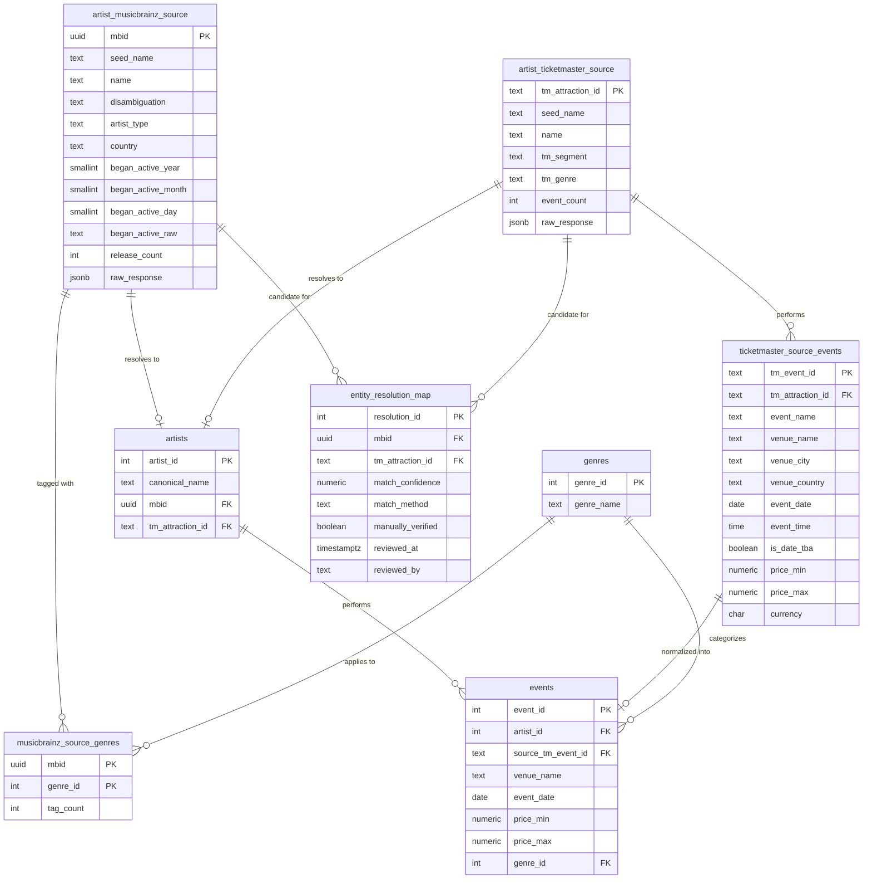

# Artist Activity: Catalog vs. Touring Data Layer (Phase 1)

Phase 1 scope only: **ingestion, storage, and entity resolution** for
comparing an artist's recorded catalog (MusicBrainz) against their live
touring activity (Ticketmaster Discovery API). No pipeline orchestration,
no RAG/agent layer, no dashboard yet -- those are later phases.

## Schema



Full DDL with rationale comments for every table/constraint: [`sql/001_schema.sql`](sql/001_schema.sql).

Three deliberate schema decisions worth calling out:

1. **Genres are a shared M2M lookup table** (`genres` + `musicbrainz_source_genres`), not a flat array column. This keeps genre strings interned once and gives referential integrity, at the cost of joins and not fixing MusicBrainz's own tag-messiness (see Limitations).
2. **Ticketmaster raw data is split into an attraction table + a child events table** (`artist_ticketmaster_source` + `ticketmaster_source_events`), matching the real 1-attraction-to-many-events shape of the API, instead of one wide row with array columns.
3. **MusicBrainz life-span dates are stored as separate nullable year/month/day columns plus a raw string**, not padded into a single `DATE`, so "formed in 1990" is never fabricated into a false claim of day-level precision.

**Phase 2, step 1**: `scripts/populate_events.py` promotes `entity_resolution_map` rows scoring `match_confidence >= 90` into canonical `artists` rows and copies their `ticketmaster_source_events` into `events`, tagging each event with the artist's single highest-tag-count MusicBrainz genre. Rows below 90 (the same threshold used for the manual review CSV) are correctly left unpromoted -- see "Verification status" above for why that's the right outcome, not a gap. This does not attempt full pipeline orchestration (scheduling, incremental re-ingestion, retries across runs) -- see Known limitations.

## Running it

```bash
cp .env.example .env
# edit .env: set TICKETMASTER_API_KEY and a real MUSICBRAINZ_USER_AGENT contact
docker-compose up -d postgres   # applies sql/001_schema.sql automatically on first run
docker-compose run --rm python python ingest_musicbrainz.py
docker-compose run --rm python python ingest_ticketmaster.py
docker-compose run --rm python python resolve_entities.py
docker-compose run --rm python python populate_events.py
docker-compose run --rm python python validate.py
docker-compose run --rm python python dashboard.py
```

Each script is independently re-runnable (idempotent upserts on natural keys) -- re-running `ingest_musicbrainz.py` after a partial failure just re-fetches and updates, it does not duplicate rows. `populate_events.py` does not delete an `artists`/`events` row if its underlying `entity_resolution_map` confidence later drops below 90 on a re-run (e.g. after a matching-logic change) -- it only adds/updates, never removes. If that matters, wipe and rebuild (`docker-compose down -v`) rather than relying on incremental cleanup.

`resolve_entities.py` writes every candidate match (exact and fuzzy) to `entity_resolution_map`, and separately writes matches scoring below the "safe" confidence threshold (90/100) to `output/manual_review_queue.csv` for a human to look at. **No automated match is ever written with `manually_verified = true`** -- that column is reserved for an actual human review step (there's a CHECK constraint enforcing that `manually_verified = true` requires `reviewed_at`/`reviewed_by` to be set, which this script never sets).

`dashboard.py` queries the current `artists`/`events`/`entity_resolution_map` state and writes a self-contained `output/dashboard.html` -- open it directly in a browser (`open output/dashboard.html`). Five views: a bubble chart of catalog age (MusicBrainz `began_active_year`) vs. current touring activity (event count), sized by release count and colored by primary genre; events by genre; the most active touring artists; events over time; and the entity-resolution confidence distribution. It's a static snapshot, not a live view -- re-run it after re-ingesting to refresh. Colors follow a validated categorical palette (light/dark, CVD-checked); the bubble chart caps at three named genres plus "Other" since an all-pairs color comparison (every genre visible at once) can't stay colorblind-safe past three. No table-view fallback is built for any chart -- for a project this size, glancing at the underlying Postgres tables is the fallback.

### Verification status and actual results

Both ingestion scripts have been run repeatedly against the real MusicBrainz and Ticketmaster APIs, and the schema/constraints have been verified against a real Postgres 16 instance. Steady-state result on the full ~50-artist seed list, after MusicBrainz's transient 503s clear on a simple re-run (idempotent, no code change needed):

- **47 of 51 seed artists (92%) resolve end-to-end** with a correct MBID <-> Ticketmaster attraction link in `entity_resolution_map`.
- **1 ingestion gap**: `Run-DMC` never returns a MusicBrainz search result under that exact spelling -- their real entry is very likely `Run-D.M.C.`. Fix the spelling in `seed/seed_artists.json` if you want this artist included; it is not a bug in the ingestion script.
- **3 resolution failures that string-matching cannot fix**, confirmed stable across multiple runs, not flakiness:
  - `Kanye West` -- MusicBrainz's top search result is "Kanye West Tribute Band" (no exact "Kanye West" entry was found among search results), while Ticketmaster's real listing is under "Ye," his legal name. Two different strings for the same real-world change, not a formatting difference.
  - `Sturgill Simpson` -- resolves correctly on MusicBrainz, but his real current Ticketmaster attraction is billed as "Johnny Blue Skies," a touring alias.
  - `Bob Marley and the Wailers` -- MusicBrainz resolves correctly ("Bob Marley & The Wailers"); Ticketmaster's keyword search for this artist appears to return only tribute-act listings (e.g. "One Drop Redemption, Tribute to Bob Marley & the Wailers") within the top 20 results, with no exact match for the real act found among them.

  Closing these three would require a manual seed-name-to-known-alias mapping, which is a data-maintenance approach rather than an algorithm change, and was deliberately not built -- see the entity-resolution limitation below.
- MusicBrainz's own API has shown itself to be unreliable under load in practice -- expect occasional runs with several artists failing on exhausted-retry 503s that clear on a simple re-run rather than needing any code change. Which specific artists fail varies run to run.

## Seed artist list

[`seed/seed_artists.json`](seed/seed_artists.json), ~50 artists. Chosen to span:
- **Genre**: rock, metal, pop, hip-hop, country, electronic, reggae, r&b, k-pop, indie/alternative, grunge, industrial, progressive rock, soul.
- **Career length**: 1960s formations (The Beatles, Yes, Willie Nelson) through 2020s debuts (Ice Spice, Olivia Rodrigo, Wet Leg).

It deliberately includes several **hard cases likely to expose entity-resolution error**, rather than being cherry-picked to make the resolver look good:
- Common-word/ambiguous band names that collide with unrelated Ticketmaster listings or tribute acts: "Chicago," "Yes," "Kiss," "Phoenix."
- Names with diacritics that a naive normalizer won't fold correctly: "Sigur Rós," "Mötley Crüe," "Beyoncé."
- Artists whose Ticketmaster attraction may not exist at all (older/legacy or catalog-only acts with no current touring attraction record) alongside artists who tour constantly.

## Known limitations

- **Entity resolution is name-string matching only.** It has no access to release dates, tour history, or any other corroborating signal. `scripts/matching.py`'s `normalize_for_matching()` folds accents (e.g. "Sigur Rós" and "Sigur Ros" now compare equal, and resolve as an exact match rather than a fuzzy one below 100 confidence) and normalizes "&"/"and" before any exact-match check, in all three scripts. It does **not** understand abbreviations, word-order differences, or stage-name aliases (e.g. "Kanye West" vs "Ye," "Sturgill Simpson" vs "Johnny Blue Skies" -- both real, unresolved cases from this seed list; fixing these would need a manual alias table, not a smarter string comparison). A common name shared by a real artist and an unrelated attraction (a tribute band, a same-named local act) will still produce a wrong or missing match with no warning beyond a lower confidence score. This is the single biggest error source in this phase.
- **Ingestion-time keyword search can still pick a tribute/cover act instead of the real artist, upstream of entity resolution entirely.** Confirmed on real runs against both APIs: querying MusicBrainz for "Kanye West" returned "Kanye West Tribute Band" as the top-scored result (MusicBrainz appears to have no entry literally named "Kanye West" any more); querying Ticketmaster for "Beyonce" returned an unrelated attraction ("JAŸ-Z") because Ticketmaster's real listing is spelled with an accent Ticketmaster's own keyword ranking didn't account for. Both ingestion scripts prefer an exact normalized-name match over the API's own relevance ranking, which has fixed the majority of observed cases (Fleetwood Mac, Depeche Mode, Aerosmith, Nine Inch Nails, Nirvana, Radiohead, Daft Punk, Shania Twain, Public Enemy, and the Beyoncé/Bob Marley accent and "&" cases all confirmed fixed across two real runs). It does **not** fix: an act whose name isn't an exact match at all after normalization (e.g. "Mini Kiss," "Ye," "Johnny Blue Skies" -- real examples from this seed list), or a real artist with no matching listing on one side at all (e.g. "The Beatles" only has tribute-act listings on Ticketmaster; no current real attraction exists to match against). Treat every match in `entity_resolution_map`, including 100/100 exact-name ones, as needing a human glance at `venue`/`event_count` for plausibility, not as ground truth.
- **`manually_verified` is never set to `true` by any script in this phase.** Every row in `entity_resolution_map`, no matter how high its confidence, is an unreviewed algorithmic guess until a human actually reviews it (see `output/manual_review_queue.csv` for the ones flagged below the safe threshold -- but even matches above that threshold have not been human-verified, just scored high enough to not need mandatory review).
- **Ticketmaster event coverage is one page (up to 200 events) per attraction, and only whatever the Discovery API currently exposes** -- typically upcoming/recent events, not necessarily an artist's full historical touring record. An artist with more than 200 currently-listed events, or one whose historical events have aged out of Ticketmaster's own data, will show an incomplete picture with no error raised.
- **MusicBrainz genre tags are free-text folksonomy, not a controlled vocabulary.** "Indie rock," "indie-rock," and "indierock" land as three separate rows in `genres` rather than being recognized as the same genre. No alias/canonicalization step exists yet.
- **No pagination retry/backfill logic** beyond the single page fetched at ingestion time; a transient failure logged for one artist requires manually re-running the ingestion script (safe to do, since it's idempotent) rather than being automatically retried later.
- **Rate-limit backoff is best-effort, not adaptive** -- both scripts use fixed exponential backoff on 429/503/5xx, not a token-bucket that reads a `Retry-After` header, so under sustained throttling they'll retry more slowly than strictly necessary rather than failing outright.
